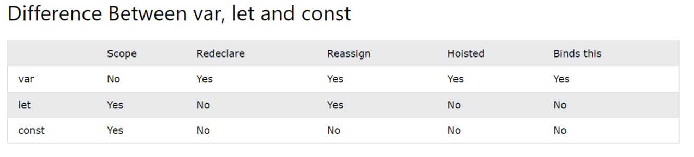

# JavaScript scripts

## Script structure
Comment:

    Single line: // to end of line
    Multi-line: /* paragraph */

## Variables

Declare:

    VariableName=VariableValue;
    var VariableName=VariableValue; // only to support older browsers
    let VariableName=VariableValue; // has block scope; MUST be declared before use; cannot be re-declared in the same scope
		E.g. let var = const1 + const2;
    const VariableName=VariableValue;

Arrays:

    Blank array: const tempArray=[];
    Initialise with contents: const tempArray=[value1,value2,value3];
	Initialise with constructor: const tempArray=new Array(value1,value2,value3);
    N.B. const tempArray=new Array(10) creates an array with 10 undefined elements
    Access: tempArray.push("value4");
    Access: let val = tempArray[n];

Named/associative arrays:
- Not supported
- Uses objects instead of name/value pairs
- See for in loop below

    const person = {fname:"John", lname:"Doe", age:25};

## Comparison operators
- Numeric - same as C#/C++/Java
- String comparisons - same as numeric operators

## Control constructs
### if/if else
- Same as C#/C++/Java

### switch
    switch(expression) {
      case x:
    	// code block
    break;
      case y:
    	// code block
    break;
      default:
    	// code block
    }

### for
    for (let i = 0; i < cars.length; i++) {
      text += cars[i] + " ";
    }

### for in
    const person = {fname:"John", lname:"Doe", age:25};
    
    let text = "";
    for (let x in person) {
      text += person[x];
    }

### for of
    const people = {fname:"John", lname:"Doe", age:25};
    for (person of people) {
      // code block to be executed
    }

### while
    while (i < 10) {
      text += "The number is " + i;
      i++;
    }

### do
    do {
      text += "The number is " + i;
      i++;
    }
    while (i < 10);

### String operations
String manipulation:

    let str = "Test String";
    let part = str.substr(2, 5); - # outputs "st St"

### Functions
Declare:

    function my_function(arg1){
    	return arg1 % 2;
    }

Call:

    myRet = my_function(100)
	if (myRet == 0){
		document.getElementById("demo").innerHTML = "Is an even number";
	}
	else{
		document.getElementById("demo").innerHTML = "Is an odd number"
	}

### I/O
Writing output:

    Writing into an HTML element, using innerHTML
    	
    
    Writing into the HTML output using document.write() - deletes all existing HTML
    	
    
    Writing into an alert box, using window.alert()
    	
    
    Writing into the browser console, using console.log()
    	

File I/O

- Generally not supported for reasons of security:

## Miscellaneous