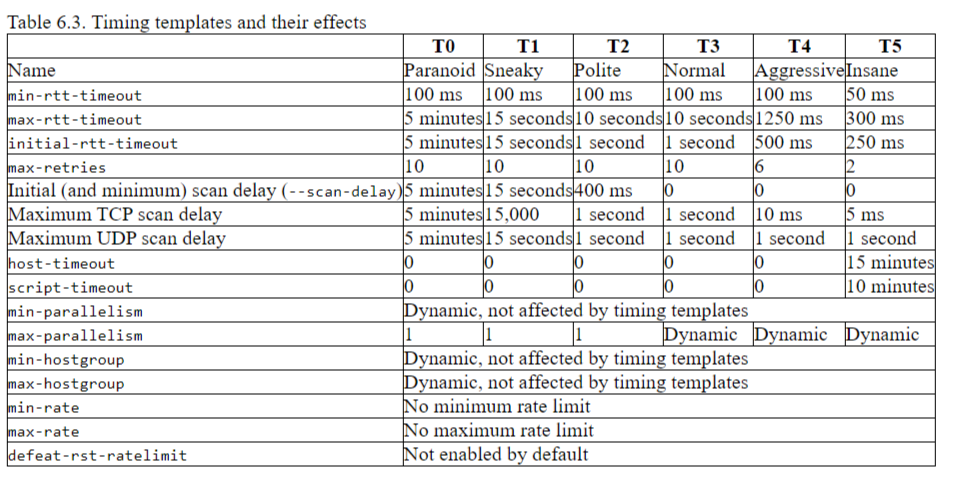
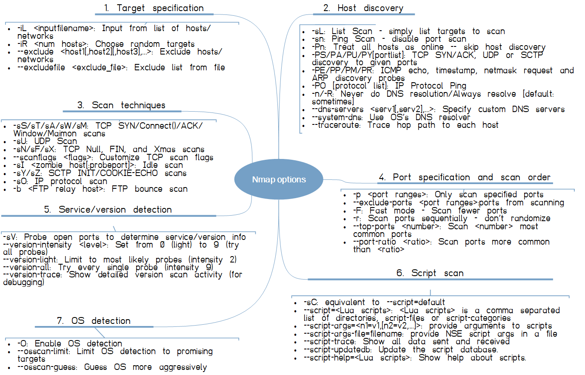
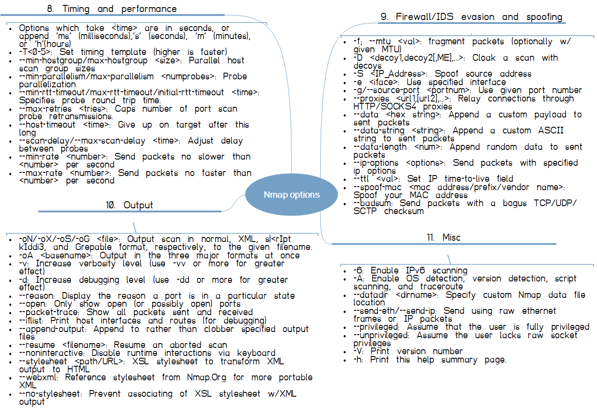

# Nmap

----------
- [General](#general)
- [Important scripts](#scripts)
- [Important switches and responses](#switches)
- [NSE libraries of interest](#libs)

----------

## <a name="general"> General </a>
### [Phases of an nmap scan](https://nmap.org/book/nmap-phases.html) - amongst other things explains where/when targets are loaded so see below for the target library

### [Timing templates](https://nmap.org/book/performance-timing-templates.html)

### [Introduction to writing an NSE script](https://nmap.org/book/nse-tutorial.html)

----------

## <a name="scripts"> Important scripts </a>
### [Using output of a discovery scan as input to an enumeration scan (-sS or -sU)](https://nmap.org/nsedoc/scripts/targets-xml.html)
Discovery scan

    nmap -sn 192.168.4.1/24 -oX discovered.xml

Enumeration scan

    nmap --script="targets-xml" --script-args="newtargets,iX=discovered.xml" -sSU -T4 -oA output --top-ports 20

### [Sniff the network for targets to scan](https://nmap.org/nsedoc/scripts/targets-sniffer.html)
    nmap --script=dns-zone-transfer.nse --script-args=newtargets,dns-zone-transfer.domain=discworld.io,dns-zone-transfer.server=192.168.4.42,dns-zone-transfer.addall -sSU -T4 -oA output --top-ports 20

### [Firewalking](https://nmap.org/nsedoc/scripts/firewalk.html)
    nmap --script=firewalk --traceroute 192.168.4.40

### [Fetch files via HTTP](https://nmap.org/nsedoc/scripts/http-fetch.html)
    nmap --script=http-fetch --script-args=destination=/tmp/mirror 192.168.4.40
    nmap --script=http-fetch --script-args='paths={/robots.txt,/favicon.ico}' 192.168.4.40
    nmap --script=http-fetch --script-args='paths=.html' 192.168.4.40
    nmap --script=http-fetch --script-args='url=/images,paths={.jpg,.png,.gif}' 192.168.4.40

### [Execute an AXFR query](https://nmap.org/nsedoc/scripts/dns-zone-transfer.html)
    nmap --script=dns-zone-transfer.nse --script-args=dns-zone-transfer.domain=discworld.io,dns-zone-transfer.server=192.168.4.42

### [Brute force enumeration of sub-domains](https://nmap.org/nsedoc/scripts/dns-brute.html)
    nmap --script=dns-brute.nse --script-args=dns-brute.domain=discworld.io,dns-brute.threads=6,dns-brute.hostlist=/usr/share/wordlists/amass/deepmagic.com_top500prefixes.txt,newtargets -sS -p 80

### [Banner grabber with service version scan](https://nmap.org/nsedoc/scripts/banner.html)
    nmap -sV --script=banner 192.168.4.42

### [Test for IP forwarding](https://nmap.org/nsedoc/scripts/ip-forwarding.html)
    nmap -Pn --script=ip-forwarding --script-args=target=google.com 192.168.4.42

### [IP geo-location (requires API key)](https://nmap.org/nsedoc/scripts/ip-geolocation-ipinfodb.html)
    nmap --script ip-geolocation-ipinfodb --script-args ip-geolocation-ipinfodb.apikey=<API_key> 192.168.4.42

### [HTTP enumeration](https://nmap.org/nsedoc/scripts/http-enum.html)
    nmap -sV --script=http-enum 192.168.4.32

### [Vulnerability identification](https://nmap.org/nsedoc/scripts/vulners.html)
    nmap -sV --script=vulners 192.168.4.32

----------

## <a name="switches"> Important switches and responses - help output </a>

----------

----------

### Discovery scan
- -sL: List Scan – DNS lookup
- -sn: Ping Scan disable port scan
- -Pn: Treat all hosts as online
- -PS/PA/PU/PY[portlist]: TCP SYN/ACK, UDP or SCTP discovery to given ports
- -PE/PP/PM: ICMP echo, timestamp, and netmask request discovery probes
- -PR -sn – ARP scan
- -PO[protocol list]: IP Protocol Ping
- -n/-R: No DNS resolution/Always resolve [default: sometimes]
- --dns-servers <serv1[,serv2],...>: Specify custom DNS servers
- --system-dns: Use OS's DNS resolver
- --traceroute: Trace hop path to each host
- -PS <ports> TCP SYN ping
- --scan-delay <*s,*ms> sparse scanning
- -Tn – timing (0-5)
- -sI – idle scan (via zombie)
- -f or –mtu – fragmentation scan

### Port scan types
- -sS/sT/sA/sW/sM: TCP SYN/Connect()/ACK/Window/Maimon scans
- -sU: UDP Scan
- -sN/sF/sX: TCP Null, FIN, and Xmas scans
- --scanflags <flags>: Customize TCP scan flags
- -sI <zombie host[:probeport]>: Idle scan
- -sY/sZ: SCTP INIT/COOKIE-ECHO scans
- -sO: IP protocol scan
- -b <FTP relay host>: FTP bounce scan

### Port scan responses
- open – application is listening (received a SYN/ACK)
- closed – the probes were received but but there is no application listening (received a RST)
- filtered – the probes were not received (no response at all)
- unfiltered – the probes were received but a connection could not be established. In other words, a port is accessible, but Nmap is unable to determine whether it is open or closed.
- open/filtered– the port was filtered or open but Nmap couldn’t establish the connection.
- closed/filtered – Nmap is unable to determine whether a port is closed or filtered.

### Fingerprinting
- -sV – basic service versioning
- -A – more intense
	- Protocol
	- Application name and version
	- OS
	- Host name
	- Device type
- Uses Common Platform Enumeration (CPE)

### Output options
- -oN – normal/nmap format
- -oX – XML
- -oG – greppable
- -oA - all formats (requires suffix)

----------

### <a name="libs"> NSE Libraries of interest - [see here for a full list](https://nmap.org/nsedoc/lib/) </a>

#### [stdnse](https://nmap.org/nsedoc/lib/stdnse.html)
> Standard Nmap Scripting Engine functions. This module contains various handy functions that are too small to justify modules of their own.

#### [target](https://nmap.org/nsedoc/lib/target.html) 
> Utility functions to add new discovered targets to Nmap scan queue 

and the reason why the `newtargets` --script-args option is important

#### [outlib](https://nmap.org/nsedoc/lib/outlib.html)
> Helper functions for NSE script output
> 
> These functions are useful for ensuring output is consistently ordered between scans and following conventions for output formatting.

#### [shortport](https://nmap.org/nsedoc/lib/shortport.html)
> Functions for building short portrules.
> 
> Since portrules are mostly the same for many scripts, this module provides functions for the most common tests.

#### [comm](https://nmap.org/nsedoc/lib/comm.html)
> Common communication functions for network discovery tasks like banner grabbing and data exchange.
> 
> The functions in this module return values appropriate for use with exception handling via nmap.new_try.

#### [vulns](https://nmap.org/nsedoc/lib/vulns.html)
> Functions for vulnerability management.
> 
> The vulnerabilities library may be used by scripts to report and store vulnerabilities in a common format.

#### [proxy](https://nmap.org/nsedoc/lib/proxy.html)
> Functions for proxy testing.

#### [packet](https://nmap.org/nsedoc/lib/packet.html)
> Facilities for manipulating raw packets.

#### [base64](https://nmap.org/nsedoc/lib/base64.html)
> Base64 encoding and decoding. Follows RFC 4648.

#### [json](https://nmap.org/nsedoc/lib/json.html)
> Library methods for handling JSON data. It handles JSON encoding and decoding according to RFC 4627.

#### [zlib](https://nmap.org/nsedoc/lib/zlib.html)
> Zlib compression and decompression library

#### [url](https://nmap.org/nsedoc/lib/url.html)
> URI parsing, composition, and relative URL resolution.

#### [unpwdb](https://nmap.org/nsedoc/lib/unpwdb.html)
> Username/password database library.
> 
> The usernames and passwords functions return multiple values for use with exception handling via nmap.new_try. The first value is the Boolean success indicator, the second value is the closure.

#### [sslcert](https://nmap.org/nsedoc/lib/sslcert.html)
> A library providing functions for collecting SSL certificates and storing them in the host-based registry.
