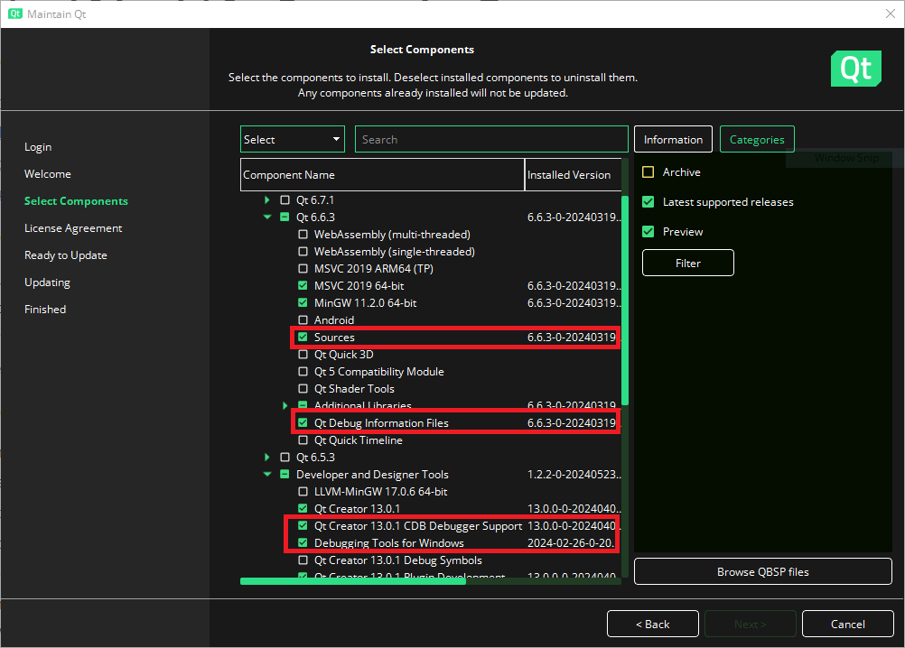
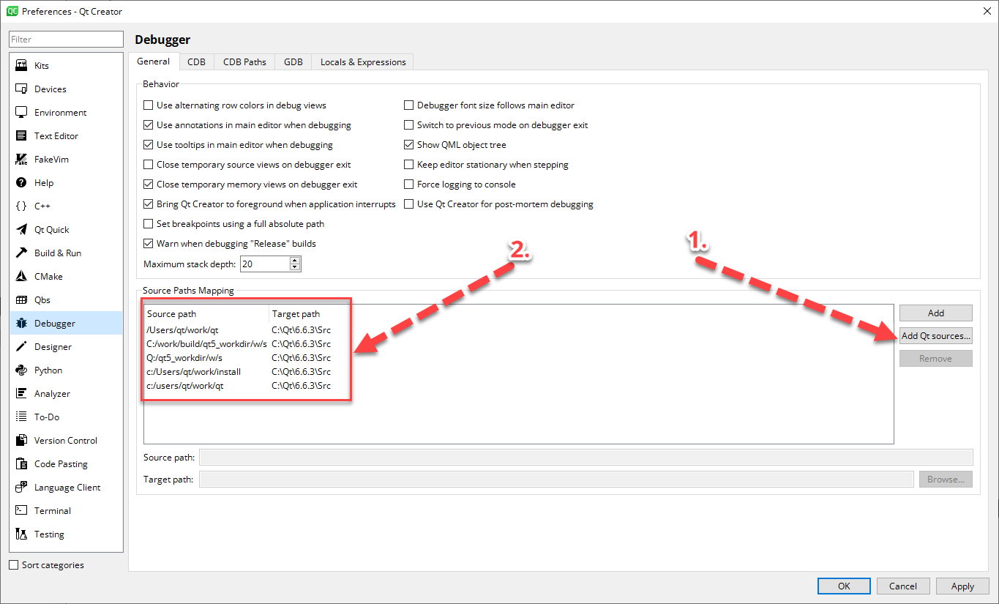

# Debugging in Qt Creator

## Qt requirements

### Maintenance wizard

1. Sources (usually optional)
2. Qt Debug information (usually optional)
3. CDB Debugger Support (usually selected by default)
4. Debugging Tools for Windows (usually selected by default)



### Qt Creator configuration

#### Configure sources

Edit -> Preferences -> Debugger -> Add Qt sources -> Select C:\Qt\<VERSION>\Src




# Memory analysis

## Windows symbols environment variables and symbol path

Name: _NT_SYMBOL_PATH
Variable: SRV*C:\SymbolCache*https://msdl.microsoft.com/download/symbols

## Setup for umdh 

```
gflags /i [IMAGE.EXE] +ust
gflags /i [IMAGE.EXE] +ust
```

Check the key in regedit: Computer\HKEY_LOCAL_MACHINE\SOFTWARE\Microsoft\Windows NT\CurrentVersion\Image File Execution Options

To change the database size call gflags from the commandline:

- Select 'Image tab'
- Enter image name, including the .exe suffix
- Hit 'Tab' key to populate
- Select 'Stack Backtrace (Megs)' at the bottom left and enter your value

Run umdh:

```
tlist | findstr *myapp.exe*
umdh -p:[PID] -f:before.txt
umdh -p:[PID] -f:after.txt
umdh before.txt after.txt > delta.txt
```

Use Windows calculator in programmer mode to conver to decimal

## Qt test harness slots:

```
void MemoryManagement::initTestCase()
{
    quint64 pid = QCoreApplication::applicationPid();
    QString umdh32 = "C:\\Program Files (x86)\\Windows Kits\\10\\Debuggers\\x86\\umdh.exe";

    QStringList argList;
    QString pidArg = "-p:" % QString::number(pid);
    QString fileArg = "-f:before.txt";
    argList << pidArg << fileArg;
    
    QProcess process;
    process.setProgram(umdh32);
    process.setArguments(argList);
    process.start();
    process.waitForFinished();

}

void MemoryManagement::cleanupTestCase()
{
    quint64 pid = QCoreApplication::applicationPid();
    QString umdh32 = "C:\\Program Files (x86)\\Windows Kits\\10\\Debuggers\\x86\\umdh.exe";

    QStringList argList;
    QString pidArg = "-p:" % QString::number(pid);
    QString fileArg = "-f:after.txt";
    argList << pidArg << fileArg;
    
    QProcess process1;
    process1.setProgram(umdh32);
    process1.setArguments(argList);
    process1.start();
    process1.waitForFinished();
    
    QProcess process2;
    QString compareDumps = "C:\\Program Files (x86)\\Windows Kits\\10\\Debuggers\\x86\\umdh.exe";
    argList.clear();
    argList << "before.txt" << "after.txt";
    process2.setProgram(compareDumps);
    process2.setArguments(argList);
    process2.start();
    process2.waitForFinished();
    
    QByteArray deltaString = process2.readAllStandardOutput();
    
    QFile f( "delta.txt" );
    if( !f.open(QIODevice::WriteOnly) ){
        qInfo() << "Couldn't open delta.txt for writing";
        return;
    }
    QTextStream ts( &f );
    ts << deltaString;
    
    f.close();
    }
```

