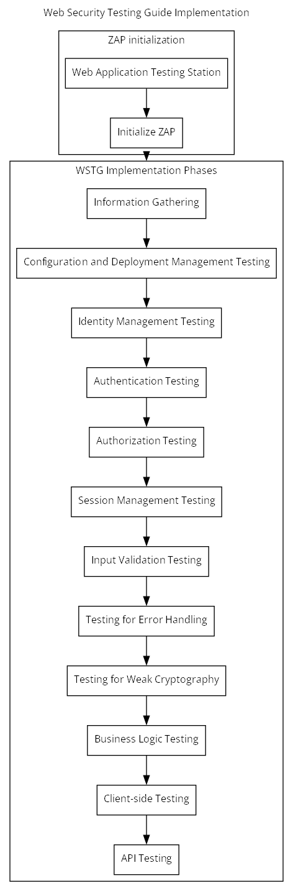

# Web Security Testing Guide (WSTG) - Web Application Security Testing

# How to prime a ZAP session (fits after 1. Information Gathering and really) 
## Initialize ZAP
### Set target and initialise sitemap
1. Make sure mode is set to 'Protected' to begin with for passive scanning only
2. Make sure that the 'Forced user' toolbar button is enabled
3. Make sure you identify and exclude any logout pages ASAP: once found, right click and select "Exclude from -> Scanner"
2. Start traditional spider from bottom tab (open a 'Spider' tab if necessary)
2. Add target site to context
3. Use Tools -> Authentication test to add a user to the context
4. Select the user in the context as 'Forced user' 
4. Start AJAX spider (use chrome headless)
5. Use 'Forced browsing' to add to the site map

# Stages
1. Information Gathering
2. Configuration and Deployment Management Testing
3. Identity Management Testing
4. Authentication Testing
5. Authorization Testing
6. Session Management Testing
7. Input Validation Testing
8. Testing for Error Handling
9. Testing for Weak Cryptography
10. Business Logic Testing
11. Client-side Testing

# Detailed stages
1. Information Gathering
	1. Conduct Search Engine Discovery Reconnaissance for Information Leakage
	1. Fingerprint Web Server
	1. Review Webserver Metafiles for Information Leakage
	1. Enumerate Applications on Webserver
	1. Review Webpage Content for Information Leakage
	1. Identify Application Entry Points
	1. Map Execution Paths Through Application
	1. Fingerprint Web Application Framework
	1. Fingerprint Web Application
	1. Map Application Architecture
2. Configuration and Deployment Management Testing
	2. Test Network Infrastructure Configuration
	2. Test Application Platform Configuration
	2. Test File Extensions Handling for Sensitive Information
	2. Review Old Backup and Unreferenced Files for Sensitive Information
	2. Enumerate Infrastructure and Application Admin Interfaces
	2. Test HTTP Methods
	2. Test HTTP Strict Transport Security
	2. Test RIA Cross Domain Policy
	2. Test File Permission
	2. Test for Subdomain Takeover
	2. Test Cloud Storage
3. Identity Management Testing
	3. Test Role Definitions
	3. Test User Registration Process
	3. Test Account Provisioning Process
	3. Testing for Account Enumeration and Guessable User Account
	3. Testing for Weak or Unenforced Username Policy
4. Authentication Testing
	4. Testing for Credentials Transported over an Encrypted Channel
	4. Testing for Default Credentials
	4. Testing for Weak Lock Out Mechanism
	4. Testing for Bypassing Authentication Schema
	4. Testing for Vulnerable Remember Password
	4. Testing for Browser Cache Weaknesses
	4. Testing for Weak Password Policy
	4. Testing for Weak Security Question Answer
	4. Testing for Weak Password Change or Reset Functionalities
	4. Testing for Weaker Authentication in Alternative Channel
5. Authorization Testing
	5. Testing Directory Traversal File Include
	5. Testing for Bypassing Authorization Schema
	5. Testing for Privilege Escalation
	5. Testing for Insecure Direct Object References
6. Session Management Testing
	6. Testing for Session Management Schema
	6. Testing for Cookies Attributes
	6. Testing for Session Fixation
	6. Testing for Exposed Session Variables
	6. Testing for Cross Site Request Forgery
	6. Testing for Logout Functionality
	6. Testing Session Timeout
	6. Testing for Session Puzzling
	6. Testing for Session Hijacking
7. Input Validation Testing
	7. Testing for Reflected Cross Site Scripting
	7. Testing for Stored Cross Site Scripting
	7. Testing for HTTP Verb Tampering
	7. Testing for HTTP Parameter Pollution
	7. Testing for SQL Injection
		7. Testing for Oracle
		7. Testing for MySQL
		7. Testing for SQL Server
		7. Testing PostgreSQL
		7. Testing for MS Access
		7. Testing for NoSQL Injection
		7. Testing for ORM Injection
		7. Testing for Client-side
	7. Testing for LDAP Injection
	7. Testing for XML Injection
	7. Testing for SSI Injection
	7. Testing for XPath Injection
	7. Testing for IMAP SMTP Injection
	7. Testing for Code Injection
		7. Testing for Local File Inclusion
		7. Testing for Remote File Inclusion
	7. Testing for Command Injection
	7. Testing for Format String Injection
	7. Testing for Incubated Vulnerability
	7. Testing for HTTP Splitting Smuggling
	7. Testing for HTTP Incoming Requests
	7. Testing for Host Header Injection
	7. Testing for Server-side Template Injection
	7. Testing for Server-Side Request Forgery
8. Testing for Error Handling
	8. Testing for Improper Error Handling
	8. Testing for Stack Traces
9. Testing for Weak Cryptography
	9. Testing for Weak Transport Layer Security
	9. Testing for Padding Oracle
	9. Testing for Sensitive Information Sent via Unencrypted Channels
	9. Testing for Weak Encryption
10. Business Logic Testing
	10. Test Business Logic Data Validation
	10. Test Ability to Forge Requests
	10. Test Integrity Checks
	10. Test for Process Timing
	10. Test Number of Times a Function Can Be Used Limits
	10. Testing for the Circumvention of Work Flows
	10. Test Defenses Against Application Misuse
	10. Test Upload of Unexpected File Types
	10. Test Upload of Malicious Files
11. Client-side Testing
	11. Testing for DOM-Based Cross Site Scripting
	11. Testing for JavaScript Execution
	11. Testing for HTML Injection
	11. Testing for Client-side URL Redirect
	11. Testing for CSS Injection
	11. Testing for Client-side Resource Manipulation
	11. Testing Cross Origin Resource Sharing
	11. Testing for Cross Site Flashing
	11. Testing for Clickjacking
	11. Testing WebSockets
	11. Testing Web Messaging
	11. Testing Browser Storage
	11. Testing for Cross Site Script Inclusion
12. API Testing
	12. Testing GraphQL